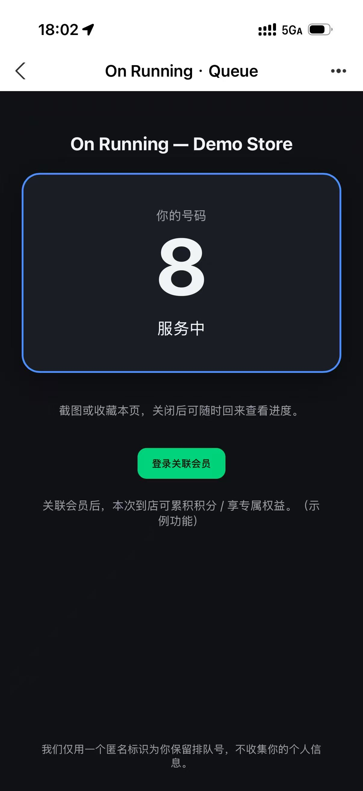

# 昂跑（On Running）线下门店排队系统 —— 方案介绍

> PoC 演示 · 约 10 分钟
> 一句话定位：**一个简单、独立、国际范、可 On Global 复用的“扫码即取号”排队服务。**

---

## 0. 我们要解决什么

目标：**让顾客扫码即排队，店员后台有序叫号，过程零摩擦。**

本方案与现场其他方案最大的不同，从需求理解阶段就分道扬镳 —— 这正是下面第 1 部分。

---

## 1. 需求理解（最关键的差异点）

> 据我了解，其他方案普遍**绑定微信小程序生态**、甚至**要求排队先注册会员**。
> 我们的判断恰恰相反 —— 排队是"低承诺、即时性"服务，**任何一次输入/授权/注册，都是流失点**。


| 我们的选择                                                      | 原因                                                                                                                            |
| ----------------------------------------------------------------- | --------------------------------------------------------------------------------------------------------------------------------- |
| **扫码端是任意支持 H5 的浏览器**（微信/支付宝/Chrome/Safari…） | 国际兼容：未来要做 global service，微信小程序海外不可用、有平台审核与强绑定                                                     |
| **不限定微信小程序，更不强制注册会员**                          | 同上 + 注册违背"排队"场景预期（参考餐厅 waitlist、乐园 virtual queue）                                                          |
| **不要求输入手机号**                                            | ① 手机号即个人信息 → 触发 PIPL/GDPR 一整套合规义务；② 强制 agreement 破坏丝滑、劝退用户；③ 店内短时等待，"短信通知"是伪需求 |
| **独立服务，不与 China 现有服务耦合**                           | ① 方便 global 复用（公司 IT 趋势）；② 与会员系统**物理隔离**，避免合规义务外溢                                                |

**核心理念：匿名为默认、实名为可选。** 先把体验做到极致，再在高意愿节点引导会员化（见第 3 部分）。

---

## 2. Client 识别：无注册、无手机号，扫码即得号

**零输入，却能认出每个人 —— 一条链路说清楚：**

```
📱 扫码
  │
  ▼
🖥️ 服务端生成匿名 clientId (UUID) + 排队号
  │
  ├─► 🍪 HttpOnly Cookie  ┐
  └─► 🔗 URL 携带 token  ┘─► 身份下发到浏览器
```

**关闭页面也不丢号 —— 三条回访路径：**


| 回访方式             | 靠什么识别 |
| ---------------------- | ------------ |
| 🕖 浏览器历史 / 收藏 | URL token  |
| 📸 截图保存          | URL token  |
| 🔄 重新扫码          | Cookie     |

> 这是迪士尼、餐厅 waitlist 等国际主流 virtual queue 的通用做法，**全程零用户输入**。

### “同一设备不同浏览器会生成多个号” —— 是有意设计，不是 bug


| 视角          | 论据                                                                                                                                                                                                              |
| --------------- | ------------------------------------------------------------------------------------------------------------------------------------------------------------------------------------------------------------------- |
| 🎯 需求       | 一个匿名标识 = “一次排队意图”。家人合用一部手机、店内共享 pad 多人取号，都是真实且应被支持的场景                                                                                                                |
| 😌 体验       | 唯一能 100% 杜绝“多号”的办法是**强制实名/手机号**——而这正是我们刻意要避免的劝退点。为了堵一个边缘情况牺牲全员的丝滑体验，得不偿失                                                                             |
| 🏛️ 行业标准 | 迪士尼、餐厅 waitlist 等匿名 virtual queue 同样以“浏览器会话”为粒度，靠**取号接口幂等 + 限流**控制刷号，而非靠强身份。我们的真正防线在服务端（同 token 幂等返回原号 + IP/设备限流），而非强迫用户证明“我是谁” |

---

## 3. BI 数据支持（面向 data 部门的未来兼容）

**立场：排队数据默认不与会员系统耦合，但从第一天起就为会员归因预留接缝。**

- **自身即有 BI 价值**：取号量、平均等待时长、放弃率、时段峰谷、门店对比 —— 全是匿名行为数据，运营价值高、不涉个人身份。
- **默认不与会员系统联系**：保持匿名/独立/全球可复用，合规风险不外溢。
- **预留自愿绑定接口**（渐进式数据贯通）：
  - 仅在 **`SERVING`（服务中）/ `DONE`（已完成）** 节点显示“关联会员” —— 此时购买意图最高、归因质量最好；不在排队早期骚扰用户。
  - 顾客点击 → 走会员系统 **OAuth/H5 登录**（平台无关，**不假设微信**）→ 拿到 `memberId` → 通过 `POST /api/tickets/:id/bind-member` 写入该票的 `memberId` 字段，完成关联。
  - `memberId` 是**不透明字符串**，排队系统不解析、不反向写会员库 → 单向引用，保持独立。
  - 绑定是**票级、不可变的归因快照**，data science 可据此把匿名排队事件归因到会员，且不被后续操作污染。

<div align="center">
  
  <p><em>仅在“服务中”高意愿节点才出现的“登录关联会员”入口（示例）</em></p>
</div>

> 给 data 部门的承诺：**不是"现在就接微信"，而是"任何会员体系、任何时候都能无损接上"。**

---

## 4. 关键细节

### 4.1 门店二维码为静态码

- 门店多为**贴纸/立牌，无屏幕设备**，动态刷新二维码不现实。
- 方案：**静态码 + 服务端签名**。URL 形如 `…/s/{storeId}?sig={signature}`，`signature = HMAC-SHA256(storeId, secret)`，长期有效，仅用于验证"这是合法门店码、防伪造刷号"。
- **防刷的真正防线在取号接口**：同 client 幂等 + 设备/IP 限流，而非二维码本身。

### 4.2 号码生命周期（排队状态机）

```
WAITING ──(进入 Ready Pool)──► READY ──(店员确认服务)──► SERVING ──► DONE
   │                              │
   │                              └──(超时未响应)──► MISSED ──(店员召回)──► READY
   │                                                  │
   │                                                  └──(召回窗口超时)──► CANCELLED
   └──(用户放弃 / 闭店清队)──► CANCELLED
```

- **Ready Pool 分批叫号**：并行服务能力 = 在岗店员数 N，按 `N + 缓冲` 自动补位，不是餐厅那种"一桌走才下一桌"的强串行。
- **过号不粗暴作废**：先降级为 `MISSED`，召回窗口内店员可一键召回；超时才失效，提示重新取号。
- 关键时间参数（READY 超时 / 召回窗口 / 服务告警）**门店级可配置**。

### 4.3 架构与技术栈

```
        ┌─────────────────────────────┐
顾客手机 │  H5 取号页 (React + Vite)    │ 扫码取号 / 实时进度
  (任意  │                             │
  浏览器)│  店员后台 (React)           │ 叫号 / 看板 / 查号
        └──────────────┬──────────────┘
                       │ HTTPS (REST + SSE 实时推送)
                       ▼
        ┌─────────────────────────────┐
        │  NestJS 后端 (Node.js)       │ 取号 / 状态机 / Ready Pool / 签名
        │  EventBus · RateLimiter      │ (进程内实现，接口化，生产可换 Redis)
        └──────────────┬──────────────┘
                       │ Prisma ORM
                       ▼
        ┌─────────────────────────────┐
        │  SQLite (PoC) → 生产可切 PG  │
        └─────────────────────────────┘
```

- **语言/框架**：TypeScript 全栈；后端 **NestJS**，前端 **React + Vite**，**Prisma + SQLite**（生产可平滑切 PostgreSQL）。
- **Monorepo 一体化**：前端 H5 + 后端 API 同仓库、统一 CI/CD，契合小型独立服务维护。
- **PoC 刻意不引 Redis**：单实例下 SSE 推送、补位串行、限流均用进程内实现，并封装为 `EventBus`/`RateLimiter` 接口，生产替换为 Redis 实现即可，业务逻辑零重写。

---

## 5. 与其他方案的差异对比


| 维度           | 其他（微信小程序生态） | 本方案                             |
| ---------------- | ------------------------ | ------------------------------------ |
| 扫码端         | 限微信小程序           | **任意 H5 浏览器**                 |
| 是否需注册会员 | 多为**强制注册**       | **完全匿名、零注册**               |
| 是否要手机号   | 常需要                 | **不需要**                         |
| 体验摩擦       | 注册/授权/同意多步     | **扫码即得号，零输入**             |
| 合规面         | 采集个人信息，义务重   | **零个人信息，合规面最小**         |
| 全球复用       | 受微信平台与地域限制   | **架构中立，可全球复用**           |
| 与会员系统     | 强耦合                 | **默认隔离 + 预留自愿绑定接口**    |
| BI 数据        | 依赖会员体系           | **自身匿名 BI + 可无损接会员归因** |

> 一句话总结：**别人在"把排队塞进微信会员体系"，我们在"做一个能服务全球、合规最轻、体验最丝滑、还能随时接上会员归因的独立排队服务"。**

---

## 现场可演示

1. 扫门店码 → 立刻拿到号（无任何输入）。
2. 多设备/多浏览器取号 → 后台看板实时分列（Waiting / Ready / Serving / Missed）。
3. 店员叫号 / 批量叫号 / 过号召回 / 服务超时告警。
4. "全部号码"查号页 → 任意号码状态回查。
5. 服务中/完成节点出现"关联会员"入口（归因接缝演示）。
